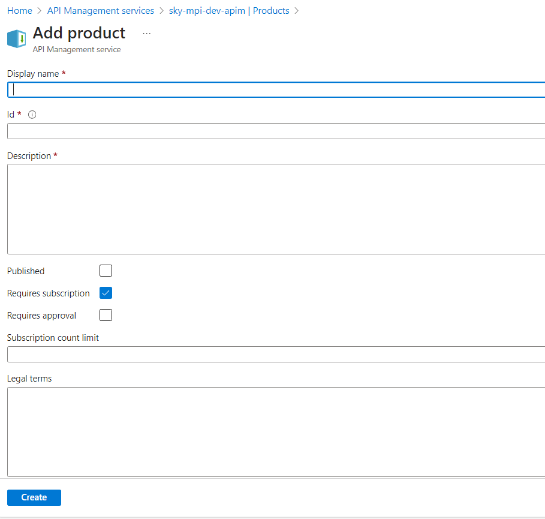
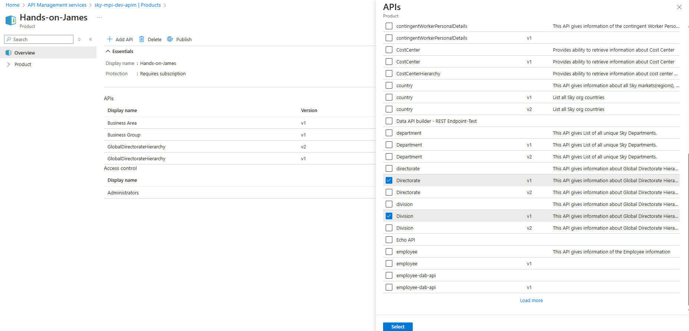

##API Product Documentation
This document outlines the steps to create and configure a new API Product in Azure API Management (APIM). It covers product creation, API assignment, versioning conventions, and subscription settings.

Step 1: Create Product in APIM
1.1 Add Product Details
1. Navigate to the API Management (APIM) service in the Azure portal.
2. Go to the Products section.
3. Click Add Product.
4. Fill in the required details:
   - Name
   - Display Name
   - Description: Include details of requested APIs.

Note: Follow your team’s naming conventions for consistency.

 1.2 Add APIs to the Product

1. In the APIs section of the Product, click + Add API to Product.
2. Select the required APIs to include.

Versioning Guidelines:
- Use v1 for user-based access.
- Use v2 for system-based access.

3. Click Save to finalize the additions.

 Step 2: Enable Subscription

1. Go to the Settings tab of the Product.
2. Enable the Requires subscription option.

This allows consumers to access APIs using a subscription key.

Additional Notes

- A new product should be created for each unique set of APIs requested by a user or system.
- Ensure correct access version (v1/v2) is selected during API assignment.

