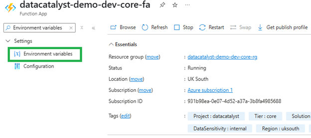
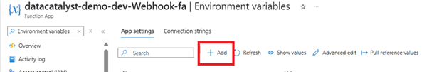
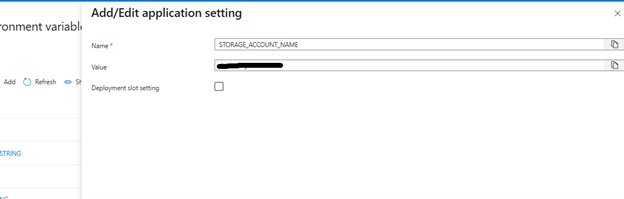
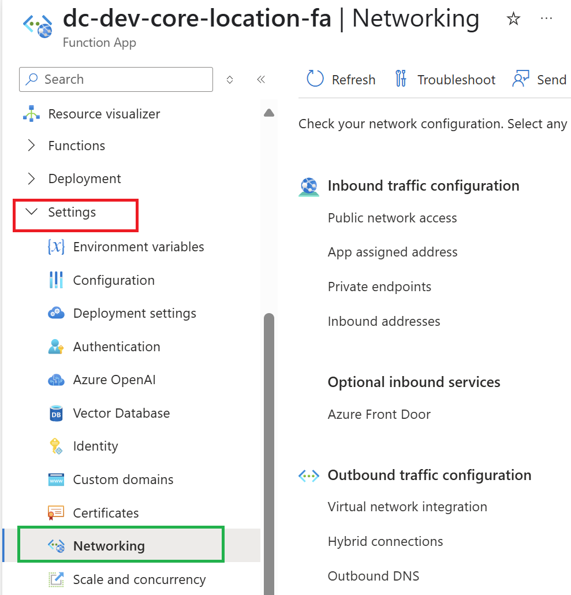
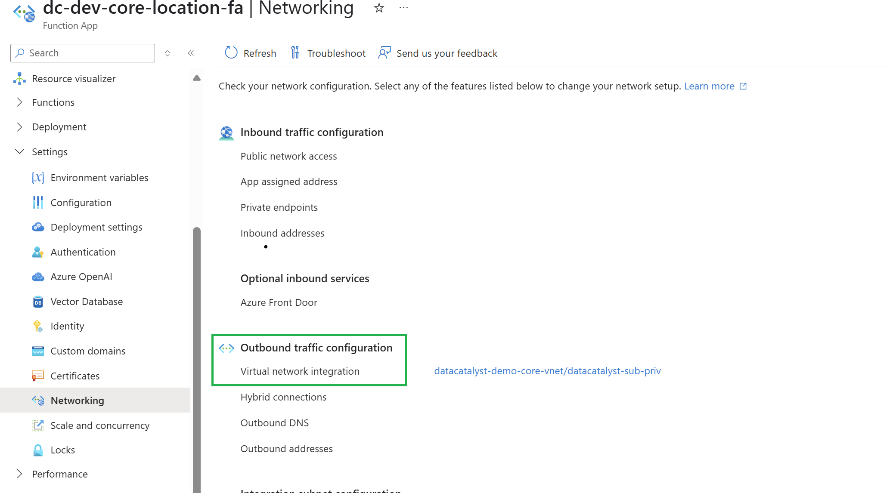

# Manual Configuration of Environment Variables in Azure Function App
This guide explains how to manually configure environment variables in your Azure Function App after deploying your function code. If your code references specific environment variables (e.g., for accessing a storage account), these must be manually defined within the Function App settings.

## Prerequisite
Ensure your Function App is already created and the function code is deployed.

## Why This is Needed?
If your function code uses environment variables—like connection strings, API keys, or storage credentials—you need to define them within the Azure Function App environment for your code to work properly.

##  Steps to Configure Environment Variables
### 🔹 Step 1: Open Your Function App in Azure
Navigate to your Azure portal and go to the Function App you have deployed. In the left-hand panel, use the search bar and search for “Environment Variables”.

---

### Step 2: Add a New Environment Variable
Click the `+ Add` button to begin adding a new environment variable.

---

### Step 3: Provide Name and Value
In the dialog that appears:

- Name: Enter the variable name as used in your code.
- Value: Provide the corresponding value.
Click OK and Save after adding each variable.

---

## ✅ Example

If your code has something like:

python
storage_account = os.environ['STORAGE_ACCOUNT_KEY']

Things to Remember
All environment variables must exactly match the names used in the code.
Secrets should never be hardcoded in your code—they should always be placed in environment variables or secured with Azure Key Vault.

##  Configure VNet Integration in Azure Function App

To secure your Azure Function App and enable outbound traffic routing through a specific Virtual Network (VNet), follow these steps:

###  Steps

1. Navigate to your **Function App** in the [Azure Portal](https://portal.azure.com/).
2. In the **Settings** section of the left-hand menu, click on **Networking**.
3. Under the **Outbound Traffic** section, select **VNet Integration**.
4. Click on the **+ Add VNet** or select an existing **VNet** from the list.
5. Choose the **VNet** you have already created and confirm the configuration.
6. Click **Save** to apply the changes.

---

Note:  
- The VNet must exist in the same region as your Function App.
- If the VNet has no subnet available for delegation, you may need to create a subnet first.

