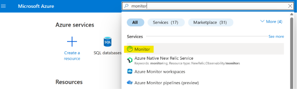
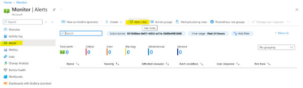
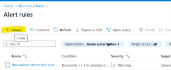
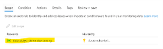
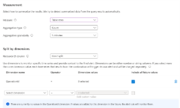
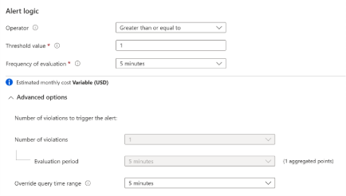
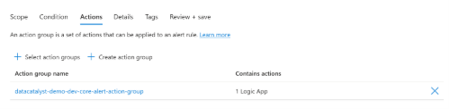

# Configure Alerts in Azure using Log Analytics
This guide walks you through the steps to set up alert rules in Azure Monitor using Log Analytics queries. These alerts help notify you of issues like API failures, using custom logic, action groups, and diagnostic settings.

##  Prerequisites
Before creating alerts, ensure the following are in place:
-  A Log Analytics Workspace is deployed and connected to your Azure resources.
-  Diagnostic Setting are enabled and pointed to the workspace.
-  Some traffic/activity has occurred so the required log tables (e.g., `ApiManagementGatewayLogs`) are populated.
- An Action Group (email/Logic App) is already deployed to respond when the alert is triggered.

---

##  Steps to Configure Alerts

### Step 1: Go to Azure Monitor
1. Open [Azure Portal](https://portal.azure.com/).
2. Search for and open Azure Monitor.



---

### Step 2: Navigate to Alert Rules
- Go to Alerts > Alert rules.
- Click + Create  to start setting up a new alert rule.



---

### Step 3: Define Alert Scope
- Select the resource group or specific resource where you want to monitor (e.g., API Management).





---

### Step 4: Configure Condition
- Signal Type: Custom Log Search  
- Query Type: Aggregated logs  
- Search Query:```kusto
ApiManagementGatewayLogs
| where IsRequestSuccess == false and isnotempty(OperationId)
| project _ResourceId, OperationId, ErrorMessage = LastErrorMessage
Set additional thresholds and frequency as per your monitoring needs.





Step 5: Add Actions
Assign the Action Group that will handle notifications (email, webhook, Logic App, etc.).



This ensures alerts are delivered to the appropriate contacts.

Step 6: Define Rule Details
Set the Alert Rule Name, Description, Severity Level (e.g., Sev 2 or Sev 3).

Configure Advanced Options such as evaluation granularity and frequency.

Example Use Case
Alert for API Gateway Failures
Logs are filtered where IsRequestSuccess == false
Alert triggers when such failures are detected

### Reference

For more information, checkout the following documentation: https://learn.microsoft.com/en-us/azure/azure-monitor/alerts/alerts-create-log-alert-rule 
