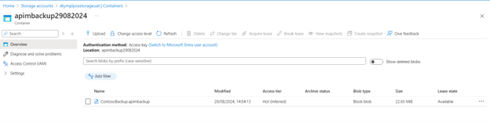
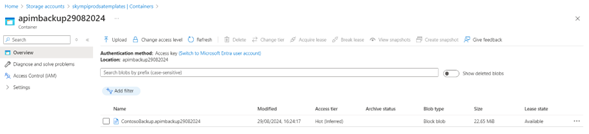
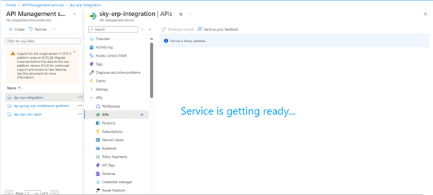

# Azure API Management (APIM) Backup & Restore Guide

This document provides step-by-step instructions for backing up an Azure API Management (APIM) instance and restoring it to a different environment (for disaster recovery or migration purposes).
--

## Prerequisites

- Azure CLI or Azure PowerShell
- Access to:
  - Source and target APIM resource groups
  - Source and target Storage Accounts
  - Appropriate Azure subscriptions

---

## Backup Process

Step 1: Collect Source APIM Details

powershell
$apiManagementName = "myapim"
$apiManagementResourceGroup = "apimresourcegroup"
$storageAccountName = "backupstorageaccount"
$storageResourceGroup = "storageresourcegroup"
$containerName = "backups"
$blobName = "ContosoBackup.apimbackup"

Step 2: Set Azure Subscription Context

Get-AzSubscription
# View current context
Get-AzContext
# Set context if needed
Set-AzContext –Subscription {sub-id}

Step 3: Run Backup Commands

$storageKey = (Get-AzStorageAccountKey -ResourceGroupName $storageResourceGroup -StorageAccountName $storageAccountName)[0].Value
$storageContext = New-AzStorageContext -StorageAccountName $storageAccountName -StorageAccountKey $storageKey

Backup-AzApiManagement -ResourceGroupName $apiManagementResourceGroup -Name $apiManagementName `
  -StorageContext $storageContext -TargetContainerName $containerName -TargetBlobName $blobName
  

  
  
## Restore Process

Step 1: Copy the Backup Blob
Copy the .apimbackup file from source storage container to the target storage container (via portal or CLI).

Step 2: Define Target Variables

$apiManagementName = "target-apim"
$apiManagementResourceGroup = "target-rg"
$storageAccountName = "targetstorage"
$storageResourceGroup = "targetstoragerg"
$containerName = "backups"
$blobName = "ContosoBackup.apimbackup"

Step 3: Set Target Subscription

Set-AzContext -Subscription "{target-sub-id}"

Step 4: Run Restore Command

$storageKey = (Get-AzStorageAccountKey -ResourceGroupName $storageResourceGroup -StorageAccountName $storageAccountName)[0].Value
$storageContext = New-AzStorageContext -StorageAccountName $storageAccountName -StorageAccountKey $storageKey

Restore-AzApiManagement -ResourceGroupName $apiManagementResourceGroup -Name $apiManagementName `
  -StorageContext $storageContext -SourceContainerName $containerName -SourceBlobName $blobName
  
  
 

Please Note -  Restoration may take 30–45 minutes depending on APIM size.

## Post-Restoration Manual Configuration

Update Backend Services:
Redirect APIs to the correct Function Apps or Container Apps in the target environment.
Update backend and inbound policies accordingly.

Update JWT Policy:
Replace the client-id/audience from the source app registration with the target environment's app registration.

## Validation
Verify the APIs are correctly restored in the target APIM instance.
Test endpoints and policies to ensure complete migration.

> 🔗 Official Microsoft Documentation:  
> [Backup and restore in Azure API Management](https://learn.microsoft.com/en-us/azure/api-management/api-management-howto-disaster-recovery-backup-restore?tabs=powershell)

