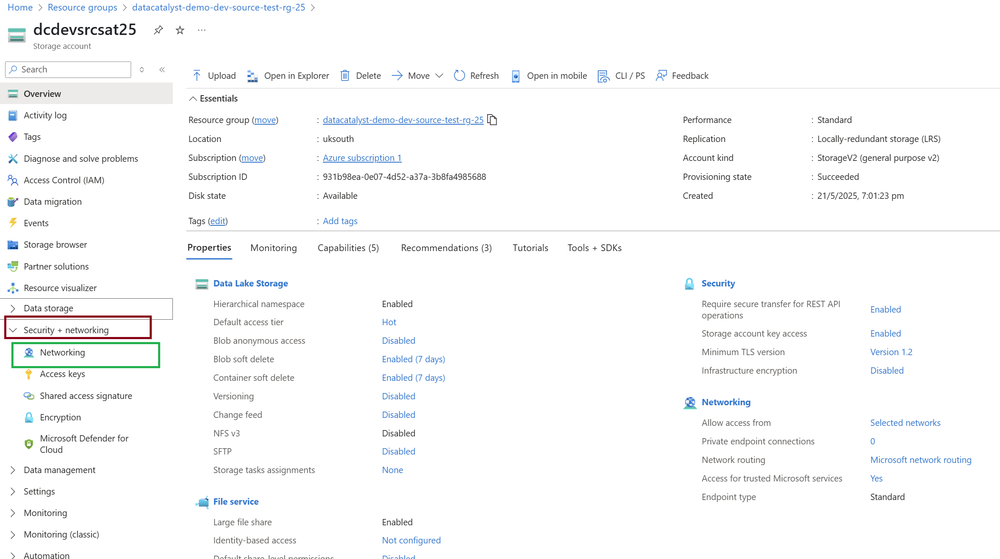
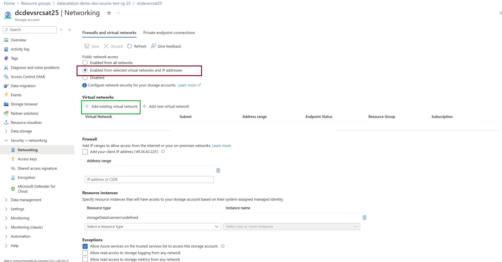

#  Configure Networking for Azure Storage Account

This guide explains how to configure VNet integration and  IP restrictions for your Azure Storage Account after deployment. This step ensures controlled and secure access to storage resources.

---

##  Prerequisite

- A Virtual Network (VNet) and Subnet must already be created.  
  → 📄 Refer to: [Subnet Configuration Guide](./ReadmeFile/subnetreadme.md)

---

##  Steps to Configure Networking

### ✅ Step 1: Open Storage Account

1. Go to [Azure Portal](https://portal.azure.com/).
2. Search for and select your  Storage Account.

---

### ✅ Step 2: Go to Networking Settings

1. In the left-hand panel, click Networking.
2. This section manages access control for your Storage Account.

---

### ✅ Step 3: Configure VNet Access

1. Under Firewalls and virtual networks, select Selected networks.
2. Click + Add existing virtual network.
3. Select:
   - Subscription
   - Virtual Network
   - Subnet you previously created
4. Click Add.

---

### ✅ Step 4: Allow Specific IP Addresses (Optional)

1. Scroll down to the IP network rules section.
2. Click + Add IP address range
3. Enter the IP address or range to allow (e.g., office/public IP).
4. Click Save.

---

### ✅ Step 5: Finalize Settings

1. Review all configurations.
2. Click Save at the top of the page.
3. Wait for a confirmation message.

---

##  Outcome

Your Azure Storage Account is now restricted to:
- The configured Virtual Network and Subnet
- Any explicitly whitelisted IPs

This improves the security posture by ensuring only trusted sources can access storage endpoints.
