#  App Registration Setup for API Security via OAuth2 (with JWT Policy)

This guide provides step-by-step instructions for setting up secure API access using Azure Active Directory App Registrations, OAuth2.0, and  JWT policies in Azure API Management (APIM).

---

## 📌 Contents

- [Architecture Overview](#architecture-overview)
- [Workflow Overview](#workflow-overview)
- [App Registrations](#app-registrations)
  - [1. Register Backend API App](#1-register-backend-api-app)
  - [2. Register Client App](#2-register-client-app)
  - [3. Authorize Client App in Backend App](#3-authorize-client-app-in-backend-app)
  - [4. Apply JWT Validation Policy in APIM](#4-apply-jwt-validation-policy-in-apim)
  - [5. Assign Users to Client App](#5-assign-users-to-client-app)
- [API Access Logic](#api-access-logic)
- [API Versions](#api-versions)
- [Testing Use Cases](#testing-use-cases)

---

##  Architecture Overview

OAuth2 with Azure AD is used to secure APIs published in Azure API Management (APIM). JWT tokens are validated by APIM using policies before granting access.

---

##  Workflow Overview

1. Client app requests an access token via Azure AD.
2. Access token includes the required scope (`PenTestScope`).
3. Client uses the token to call protected API in APIM.
4. APIM validates the token via `validate-jwt` policy.
5. Access is granted if the token is valid and scoped correctly.

API Security Architecture

[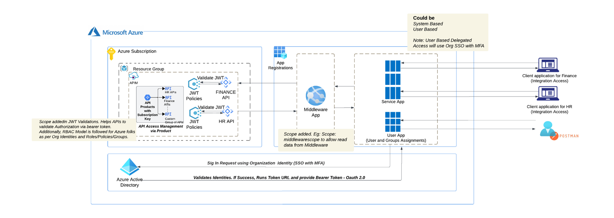](./appregistration1.png)

Workflow Overview: Accessing APIs for Target Requestors

[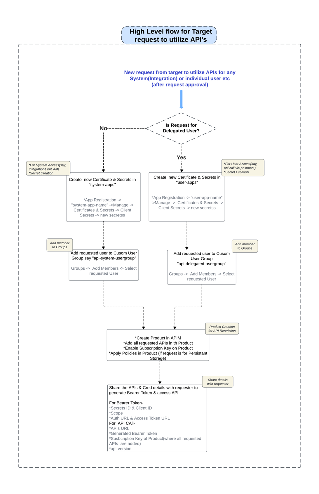](./appregistration2.png)

Step 1: Register an application in Azure AD to represent the API
Register an application (backend-app) in Azure AD to represent the protected API resource.​
	1. In your Azure Portal, go to Azure Active Directory, select App Registrations
	2. Select New registration
	 3. When the Register an application page appears, enter your application's registration information:
			a. In the Name section, enter a meaningful application name that will be displayed to users of the app, such as backend-app, Say Middleware-Application-API 
   4. Leave the Redirect URI section empty.
	 5. Select Register to create the application.
	 6. On the app Overview page, find the Application (client) ID value and record it for later.

[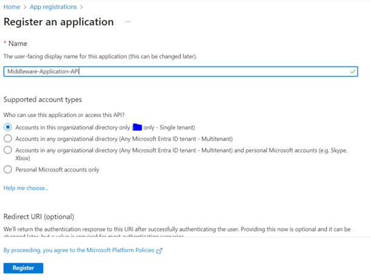](./appregistration3.png)
[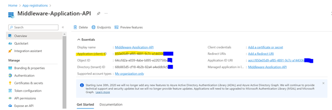](./appregistration4.png)

7. Under the Manage section of the side menu, select Expose an API and set the Application ID URI with the default value
8. Click on Add Scope

[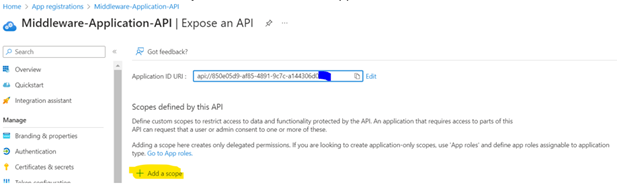](./appregistration5.png)

9.Give scope name and for consent select Admin & users.

[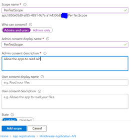](./appregirstration6.png)
[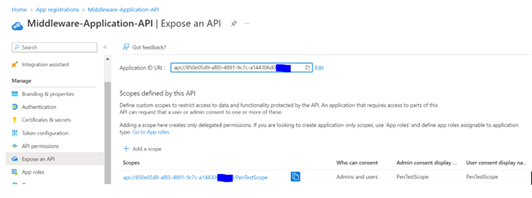](./appregistration7.png)

10. Under the Manage section of the side menu, select Manifest and change the value for "accessTokenAcceptedVersion" from Null to 2 and save it.

[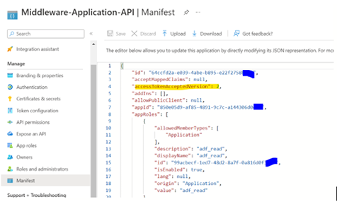](./appregistration8.png)

Step 2: Register another application in Azure AD to represent a client application.
 
Register client application that calls the API as an application in Azure AD. 
1. Follow 1-6 steps from above and create client application.
[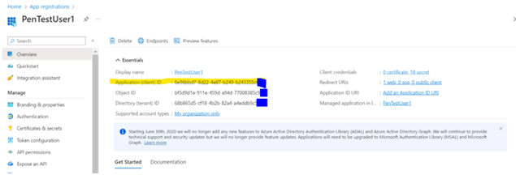](./appregirstration9.png)

2. Under the Manage section of the side menu, select Certificates & secrets.
· Under Client secrets, select New client secret.
· Under Add a client secret, provide a Description and choose when the key should expire.
· Select Add.
· Note: When the secret is created, note the key value for use in a subsequent step (Note: you can't see/copy this value once you move away from this page, but you can create New Client Secret as needed).

[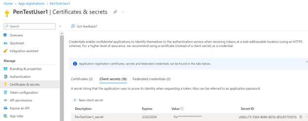](./appregirstration10.png)

3. Under the Manage section of the side menu, select Authentication. Add Callbcak URI for Postman https://oauth.pstmn.io/v1/browser-callback
 
4. Select Add a platform -> web -> Redirect URIs and enter “ https://oauth.pstmn.io/v1/browser-callback”4.Under the Manage section of the side menu, select API Permission -> Add a permission -> My APIs-> select your Backend Application (in our case it is Middleware-Application-API) -> delegated Permission -> select the scope which you created,”PenTestScope” and add permission

[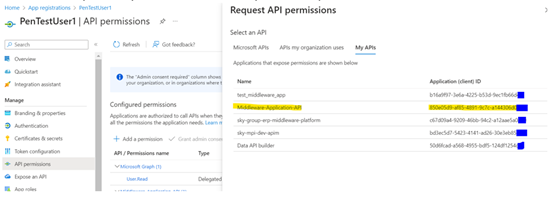](./appregistration11.png)
[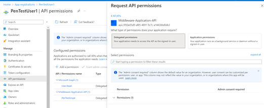](./appregirstration12.png)
[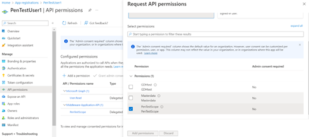](./appregirstration13.png)

Note: 
Delegated User: For individual user access we will select Delegated Permissions, where your application needs to access API as the signed-in user
Application Permissions: Application permission will be used for application-based access example if requirements comes from HR or FINANCE for building Integrations, then in that case we will select Application Permission. Also note, for Application based permissions, we require ORGANIZATION Global Admin Consent.

Step 3: Add Client ID of Client Application to Backend Application

1.Go to Middleware-API-Application, Under the Manage section of the side menu, select Expose an API 

2. Under “Authorized client applications”. Add client ID of client Application, PenTestUser1

[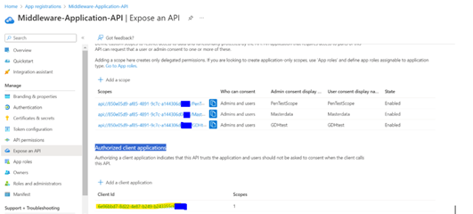](./appregistration14.png)

Step 4: Configure a JWT validation policy to pre-authorize requests.
1.Add the following Validate JWT policy to <inbound> policy section of your API in inbound section. 
2.Go to your APIM instance, select APIs from side menu -> select the API on which you want to apply JWT Policy ( i.e. Policy will be attached to requested API access by consumer)
<policies>
    <inbound>
        <base />
        <rate-limit calls="10" renewal-period="60" />
        <quota-by-key calls="1000000" bandwidth="1000000" renewal-period="241920" counter-key="default" />
        <validate-jwt header-name="Authorization" failed-validation-httpcode="401" failed-validation-error-message="Unauthorized. Access token is missing or invalid">
            <openid-config url="https://login.microsoftonline.com/organizations/v2.0/.well-known/openid-configuration" />
            <audiences>
                <audience>850e05d9-af85-4891-9c7c-a144306XXXXX</audience>
            </audiences>
            <required-claims>
                <claim name="scp" match="any">
                    <value>PenTestScope</value>
                </claim>
            </required-claims>
        </validate-jwt>
    </inbound>

[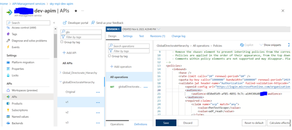](./appregistration15.png)
Step 5: Enable Assign users in Client Application 

Assign users to client application, “PenTestUser1” so that only assigned user have the access to use the APIs.
1.Go to Enterprise Application -> search your Client Application “PenTestUser1”
2.Under the Manage section of the side menu, select “Properties” and enable  “Assignment required”

[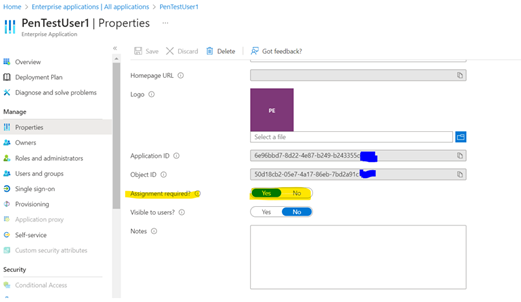](./appregistration16.png)

3. Now go to Users and Groups, and users for which you want to provide access. Here you can revoke access by removing users at a later stage as per requirements.
[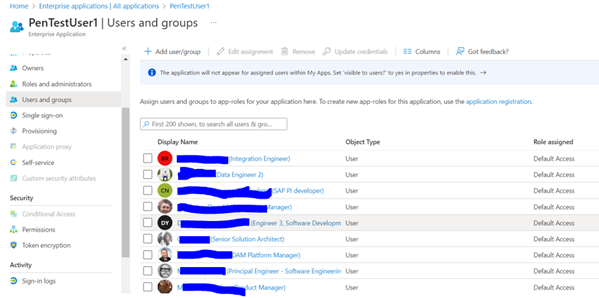](./appregirstration17.png)

How Access to requested APIs are given?
When a user requests access to specific APIs within Azure API Management (APIM), we ensure they only have access to the APIs they need. This process involves adding the requested APIs to a Product in APIM and enabling a Subscription Key on Product for those APIs. Here's how the process works:

1. Request and Identification:
o A delegated user(individual user) from a target system, such as HR, requests access to certain APIs. This can be for all APIs or a subset, such as just three specific APIs. 
o If the request is for Application Access (Integration Purpose where MFA not required) from a target system, such as HR, requests access to certain APIs. This can be for all APIs or a subset, such 
as just three specific APIs.

2. API Selection and Product Creation:
o The requested APIs are grouped into a Product in APIM. This product is configured to include only the APIs that the user has requested access to.
	
3. Subscription Key Activation:
o A Subscription Key is enabled for the Product. This key is essential for accessing the APIs within the Product.
	
4. OAuth2 Authentication (for delegated user):
o The user uses OAuth2 for authentication. They generate a bearer token using the Secret ID, Client ID, Auth URL, and Token URL. This bearer token proves their identity and grants them access permissions.
	
 5. API Call Execution (for Delegated user via Postman or any tool):
o When making API calls (e.g., using Postman), the user must include the generated bearer token, the Subscription Key provided for the Product & api-version as header to make a API Call. The bearer token authenticates the user, while the Subscription Key authorizes access to the specific APIs.
	
6. Access Control Verification:
o If the API call does not include the correct Subscription Key, an error message such as "401 Unauthorized-missing susbcription" is returned.

[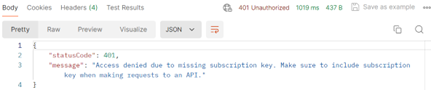](./appregistration18.png)

o If an invalid Subscription Key or a key for a different Product is used, an "401 Unauthorized -Invalid Subscription Key" error is returned.

[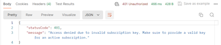](./appregistration19.png)

7. For Application Access:
o The user configures Secret ID, Client ID, Scope & api-version as header in the integration. This is Application access hence user sign in (MFA) is not required.
 
This meticulous process ensures that the user can only access the APIs they have been explicitly granted access to. The combination of OAuth2 authentication and Subscription Key authorization effectively secures the API access, providing granular control over who can access which APIs.

API Versions
In the APIM, for thr APIs we have created different version of APIs, which has to be pass as header while making API call
· API Version: Original
	o For the Original Version of APIs, we have enabled Mock response.
· API Version: v1
	o Key: api-version, Value: v1. This header needs to be passed along with other header while making api call
	o The v1 Version of APIs are for APIs to get real data
