# Manual Setup: Volume Mount and Container Configuration in Azure App Services
This guide explains how to manually configure  volume mounts  and container settings in Azure App Services, specifically for scenarios involving configuration files (e.g., `dab-config.json`) hosted on Azure Files, used by containerized applications like Data API Builder.
---

##  Prerequisite
You must have already:
- Deployed an Azure Container App.
- Created a configuration file (`dab-config.json`).
- A storage account available to host the config.
---

##  Part 1: Upload Configuration Files to Azure File Share

### Step 1: Go to the Azure Portal and Open the Storage Account
1. Navigate to your Storage Account.
2. Under Data storage, select File shares.

### Step 2: Create a File Share
1. Click on + File share.
[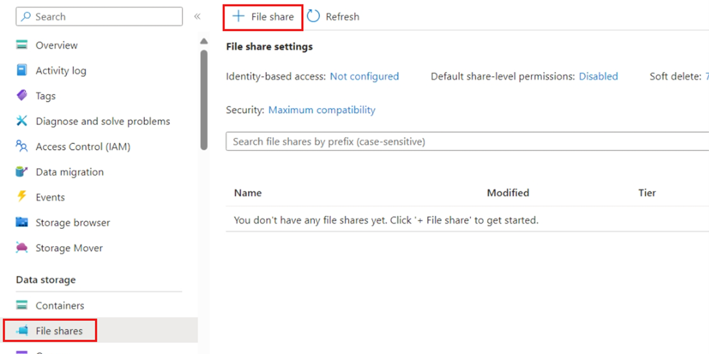](./Containerconfig1.png)

3. Configure the name, quota, and tier as needed.

[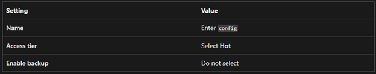](./Containerconfig2.png)

4. Click Create.

### Step 3: Upload Files
1. Open the newly created file share.
2. Click Upload, select your `dab-config.json` and any other required files.
3. Click Upload.
   
[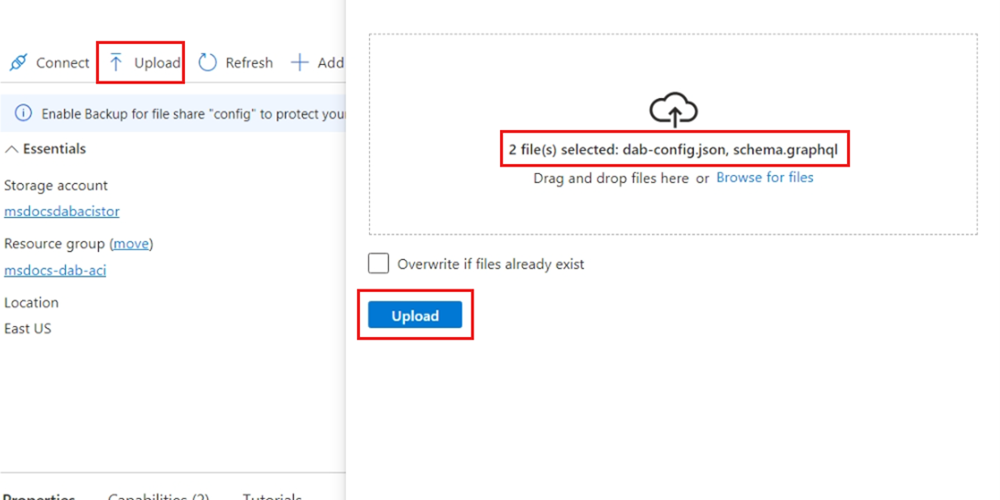](./ContainerConfig3.png)

### Step 4: Retrieve Access Keys
1. In the same Storage Account, go to Security + networking > Access keys.
2. Note down the Storage account name and one key value — these are needed for mounting.
[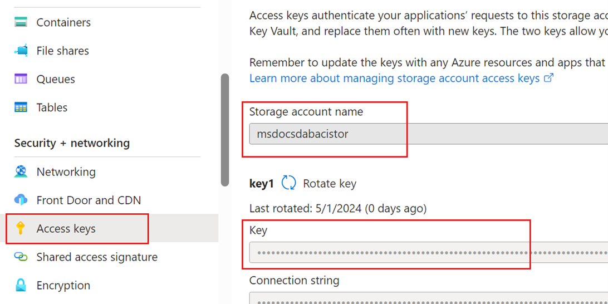](./ContainerConfig4.png)
---

##  Part 2: Mount Azure File Share to Container Environment

### Step 1: Navigate to the Container App Environment
1. Go to your Container App Environment in the Azure portal.
2. Under Settings, select Azure Files.

### Step 2: Add Azure File Share
1. Click + Add.
2. Provide:
   - File share name
   - Storage account name
   - Storage account key
3. Save the configuration.

[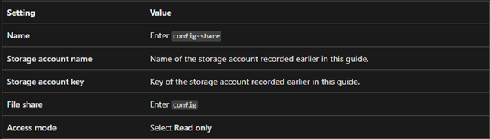](./Containerconfig5.png)

[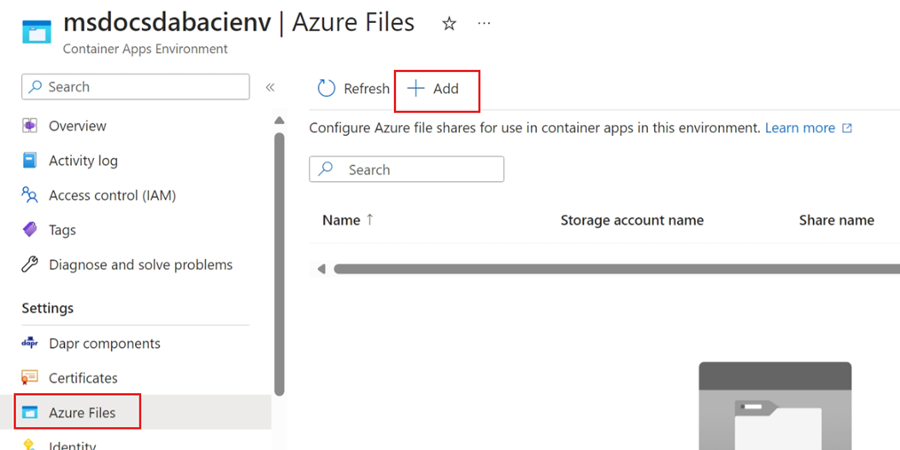](./Containerconfig6.png)

---

##  Part 3: Create Volume and Mount It to Container

### Step 1: Create New Revision
1. Navigate to your Container App.
2. Under Application, go to Revisions and replicas.
3. Click Create new revision.

### Step 2: Add Volume
1. Go to the Volumes section.
2. Click Add .
3. Specify:
   - Volume name
   - Azure Files share (linked earlier)

[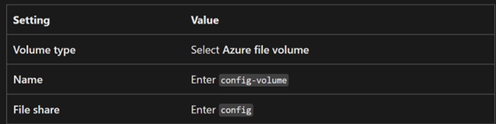](./Containerconfig7.png)

### Step 3: Mount Volume to Container
1. Go to the Container section.
2. Select the active container and click Edit.
3. Add mounts:
   - One for the `dab-config.json`
   - Another if needed for additional files
4. Save your changes.

[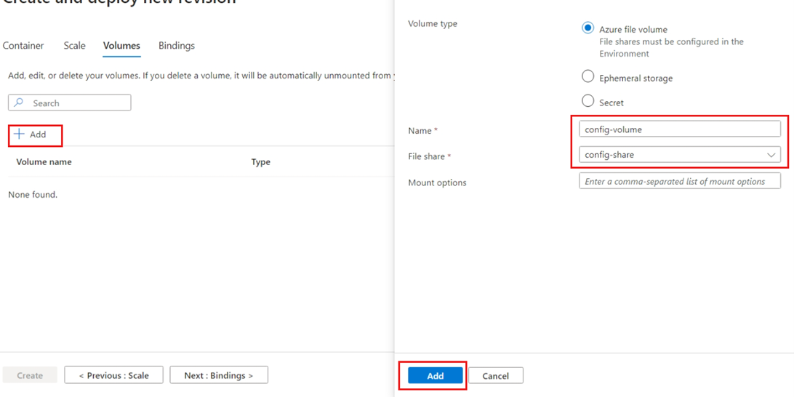](./Containerconfig8.png)

[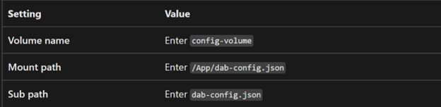](./Containerconfig9.png)

[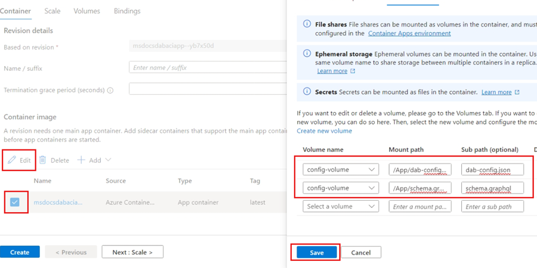](./Containerconfig10.png)

### Step 4: Finalize Revision
1. Click Create to deploy the new revision.
2. Wait for the deployment to complete.
---

##  Part 4: Add Database Connection Using Azure Key Vault

### Step 1: Create Secret in Key Vault
Create a secret for the SQL connection string in Azure Key Vault.

### Step 2: Add Secret Reference in Container App
1. Go to your Container App.
2. In the left menu, search for Security, and select Secrets.

[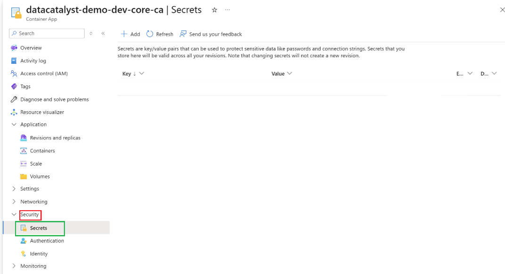](./Containerconfig11.png)

### Step 3: Add Key Vault Reference
1. Click + Add secret.
2. Enter:
   - Key name (your choice)
   - Type: Key Vault reference
   - Key Vault secret URL (copy from Key Vault)
3. For Managed Identity, select System assigned.

[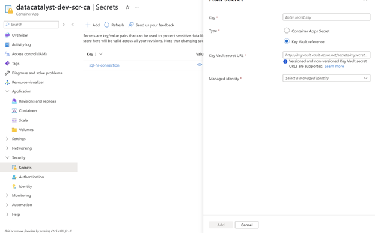](./Containerconfig12.png)
---

##  Reference

For additional details, refer to [Microsoft’s official documentation](https://learn.microsoft.com/en-us/azure/container-apps/)

