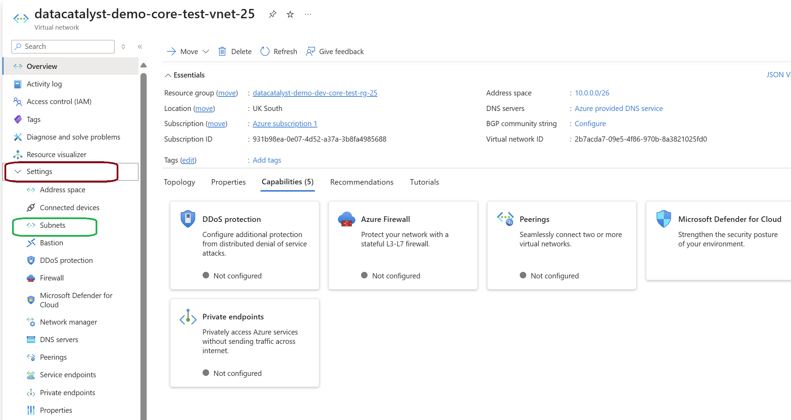
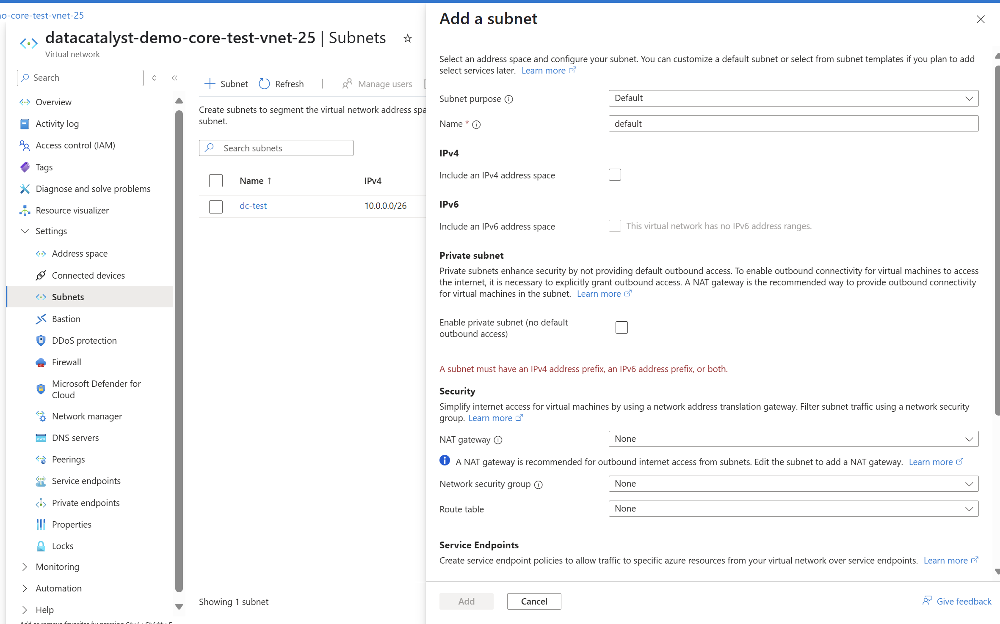

#  Create a Subnet in a Virtual Network (VNet) – Azure

This guide walks you through the steps required to create a subnet within an existing Virtual Network (VNet) using the Azure Portal.

---

##  Prerequisites

- You must have an existing  Virtual Network (VNet)  in your Azure subscription.
- Appropriate permissions (e.g., Network Contributor  role or higher).

---

##  Steps to Create a Subnet

### 1. Log in to Azure Portal

Go to: [https://portal.azure.com](https://portal.azure.com)

---

### 2. Open Virtual Networks

From the left-hand navigation menu or the search bar at the top, search for "Virtual networks" and click to open it.

---

### 3. Select an Existing VNet

From the list, click on the Virtual Network where you want to add the subnet.

---

### 4. Go to the "Subnets" Section

In the selected VNet’s Settings pane (left-side menu), click on Subnets.

---

### 5. Add a New Subnet

Click on `+ Subnet` at the top to open the Add subnet panel.

---

### 6. Fill in Subnet Details

-Subnet Name: Provide a meaningful name (e.g., `backend-subnet`)
- Subnet Address Range: Enter a CIDR range (e.g., `10.0.1.0/24`)

---

### 7. (Optional) Advanced Settings

You may optionally configure:
- Network Security Group (NSG)
- Route Table
- Service Endpoints
- Delegation Settings

---

### 8. Click "Add"

Once filled, click Add  to create the subnet.

---

### 9. Verify Subnet Creation

After creation, the new subnet will appear in the Subnets list of your Virtual Network.

---

##  Result

You’ve successfully created a new subnet in your VNet, and it’s ready to be associated with other Azure resources like VMs, Function Apps, or Containers.

