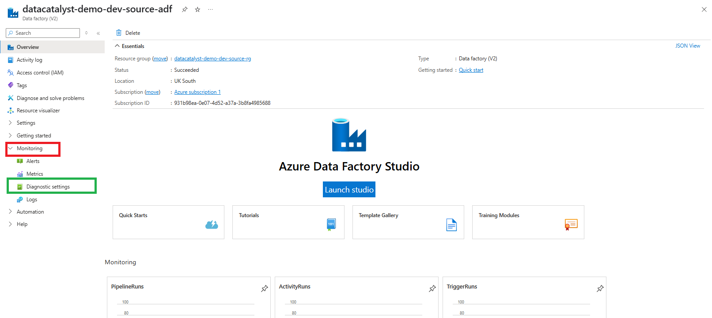
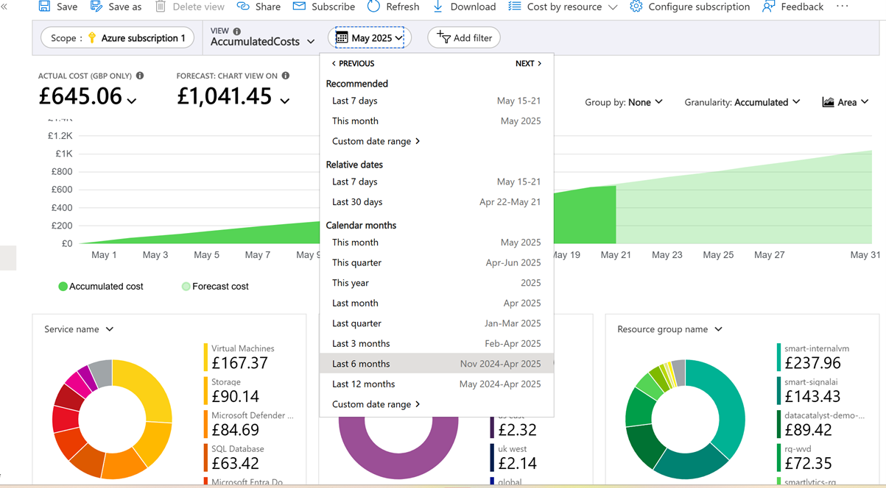
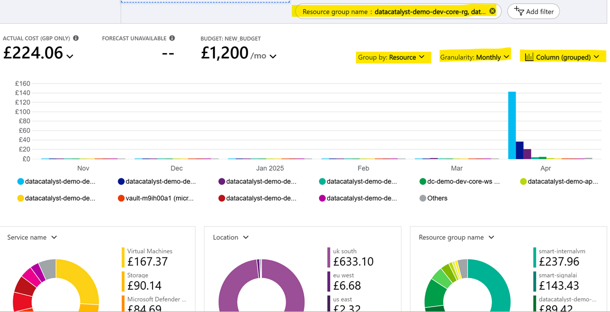
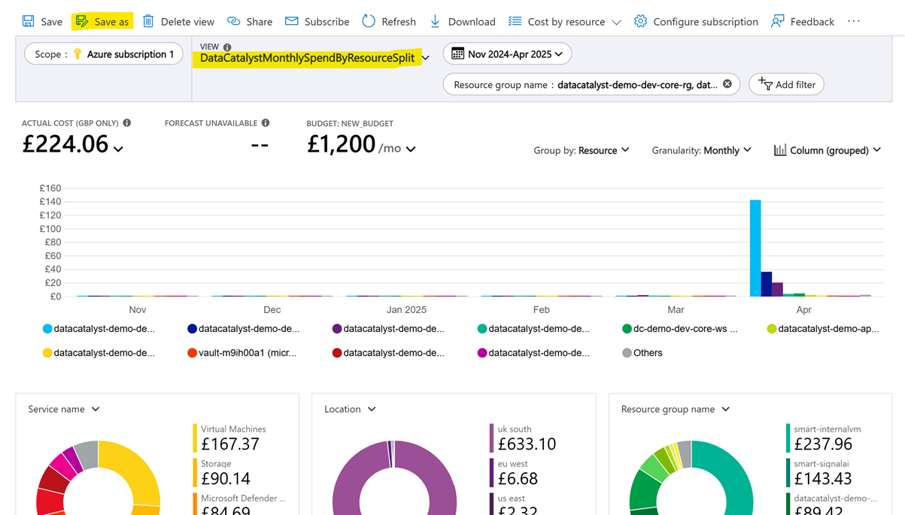
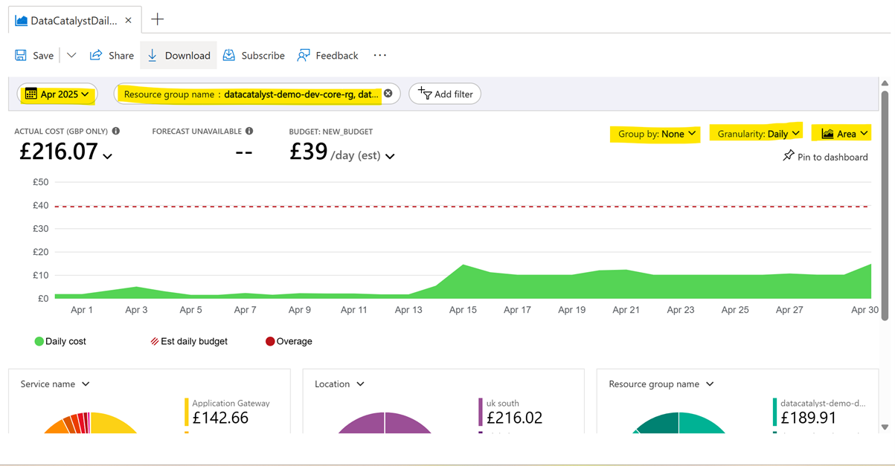

#  Azure Dashboard Readiness Guide

This guide outlines the essential configuration steps to ensure your Azure dashboards (e.g., for Data Factory or cost tracking) populate correctly with diagnostic and cost data.

---

## 1.  Configure Diagnostic Settings for Azure Data Factory

> Important: Diagnostic settings must be enabled  before deploying your monitoring dashboard. Without it, metrics and logs will not appear.

###  Steps:

1. Go to your Azure Data Factory instance in the [Azure Portal](https://portal.azure.com/).
2. Navigate to the linked storage account for logs and metrics.
3. Use the search bar or under Monitoring, find Diagnostic settings.
4. Click + Add diagnostic setting .
5. Enable:
   - Send to Log Analytics (select your workspace)
   - Archive to a storage account (optional for auditing)
   - Enable all relevant logs and metrics
6. Click  Save.

>  Repeat the same for any other Azure services involved (e.g., Function App, Key Vault, etc.).

---

## 2.  Build Cost Analysis on Azure

> Purpose: These steps ensure your Cost Management dashboard is correctly populated with relevant Azure spend data.

---

### 📆 Monthly Cost View (Last 6 Months)

#### Steps:

1. Go to Cost Management + Billing > Cost Analysis.

2. In the Period dropdown, select Last 6 Months.
3. Apply optional filters such as:
   - Resource Group
   - Service Name
4. Customize:
   -Group by → `Resource`
   - Granularity → `Monthly`
   - Chart type → `Column` or preferred
5. Click Save and name it:  
   `DataCatalystMonthlySpendByResourceSplit`

---

### 📅 Daily Spend Trend (Last 1 Month)

#### Steps:

1. Stay in Cost Analysis section.
2. Change Period to Last 1 Month.
3. Customize:
   - Group by → `Resource`
   - Granularity → `Daily`
   - Chart type → `Line` or `Area`
4. Save this view with the name:  
   `DataCatalystDailySpendLastMonth`

---
