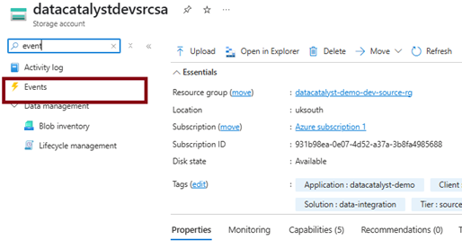
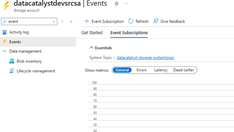
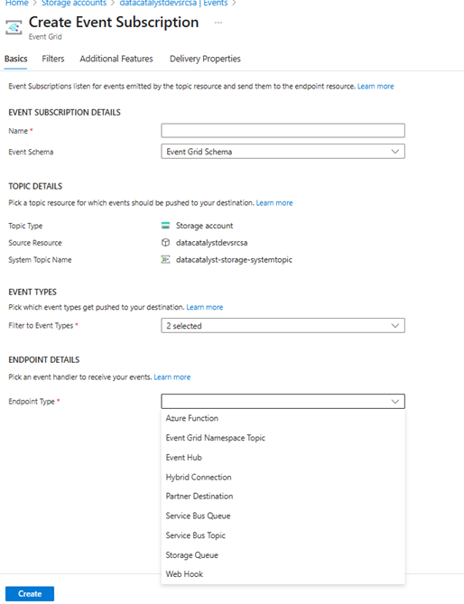

# Configuring Event Grid System Topic for Azure Storage Account and Webhook Integration.

This guide explains how to configure an Event Grid System Topic for an Azure Storage Account and integrate it with a Webhook endpoint, such as an Azure Function App or any HTTP-triggered API.
---

##  Objective
Enable automatic event-driven workflows by subscribing your storage account to events like blob uploads or deletions, and routing them to a webhook endpoint.
---

## 🛠 Steps to Configure
### 🔹 Step 1: Go to the Storage Account
Open the desired Storage Account in the [Azure Portal](https://portal.azure.com/).
In the left-hand search bar within the storage account, type "Event".

---

### 🔹 Step 2: Click on “Event Subscriptions”
From the results, select Event Subscriptions to begin the configuration.

---

### 🔹 Step 3: Configure the Event Subscription
Click + Event Subscription, and fill out the following:

- Name: A unique name for this subscription (e.g., `blob-created-subscription`)
- Event Types: Select the events you want to subscribe to (e.g., `Blob Created`)
- Endpoint Type: Choose Webhook
- Endpoint URL: Enter your webhook or HTTP-triggered Azure Function URL

Then, click Create.

##  Example Use Case

Let’s say you have an Azure Function that processes CSV files when uploaded to a container.

- You create a system topic for `BlobCreated` events.
- You connect that to the HTTP trigger of your Azure Function.
- Now, anytime a file is uploaded, your function is automatically invoked.

---

## Security Tips

- Make sure your webhook endpoint validates incoming requests (e.g., using validation tokens).
- Protect your HTTP endpoint using Azure AD or an API management gateway if needed.
- Use retries and logging to ensure no events are missed.

---
