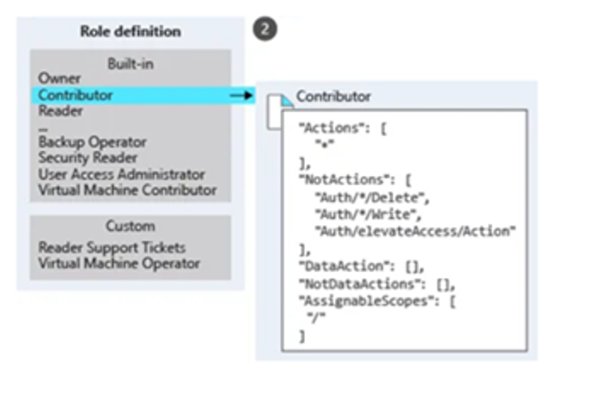

# Azure RBAC Model 

## Introduction
Azure Role-Based Access Control (RBAC) is a powerful identity and access management system that governs access to Azure resources. RBAC allows organizations to manage permissions within Azure subscriptions, ensuring that users have the right level of access to resources based on their roles and responsibilities.

## Description
The Azure RBAC model is a cornerstone of our security and access management strategy. Here's why RBAC is essential:

## Granular Access Control
RBAC enables fine-grained control over access to Azure resources. This is crucial in a middleware project where different team members have varying roles, and each role requires specific permissions.

## Secure Access to Critical Resources
With a project utilizing Azure API Management (APIM) service, Developer Portal, Function Apps, Storage Accounts, and Key Vault, RBAC ensures that only authorized personnel have access to critical resources. This helps prevent unauthorized modifications and enhances security.

## Adaptability Across Environments
With three subscriptions (Dev, UAT, Prod) and corresponding resource groups, RBAC allows us to customize access control based on the environment. This adaptability is essential as the project progresses through different stages of development.

## Compliance and Least Privilege Principle
RBAC helps enforce compliance by adhering to the principle of least privilege. Users are granted only the permissions necessary for their roles, reducing the risk of accidental misconfigurations or data breaches.
---

## RBAC Architecture Overview
We can control access to resources using RBAC by creating Role Assignments, which control how permissions are enforced.

## Role Assignment
A role assignmentis the process of attaching a role definition to a user, group, service principal, or managed identity at a particular scope for the purpose of granting access. Access is granted by creating a role assignment, and access is revoked by removing a role assignment.
To create a role assignment, we need three elements:  
- Security Principal(who)  
- Role Definition(what)  
- Scope(where)  
These elements correspond to:

---

## 1. Security Principal (Who)
This represents a user, group, service principal, or managed identity that is requesting access to Azure resources. We can assign a role to any of these security principals.
- Usersare the individuals who would need Azure Portal access for managing or developing middleware resources.
- Groupsare collections of users.
- Service Principalsare used for apps that need specific access and control.
- Managed Identitiesare used when we want Azure to handle login details and enable communication between Azure resources.

---

## 2. Role Definition (What)
A role definitionis a collection of permissions. It lists the permissions that can be performed, such as read, write, and delete. Roles can be high-level, like `Owner`, or specific, like `Azure Function Contributor`.
Azure includes several built-in roles, such as:
- Owner– Full access to all resources, including the right to delegate access to others.
- Contributor– Can create and manage all types of Azure resources but cannot grant access to others.
- Reader– Can view existing Azure resources.
- User Access Administrator– Can manage user access to Azure resources.

  

> If the built-in roles do not meet the specific needs of our requirement, we can create our own custom roles.

---

## 3. Scope (Where)
Scopedefines where the access applies.
In Azure, scope can be defined at multiple levels:
- Management Group
- Subscription
- Resource Group
- Resource
 
  

Scopes are structured in a parent-child relationship.  
> Granting access at a parent scope automatically grants access to all child scopes.

Example: 
Assigning the `Contributor` role to a group at the subscriptionlevel means that role is inherited by all resource groupsand resourceswithin that subscription.

---

## Azure Subscriptions

Each Azure subscription is associated with a single Azure AD directory**.  
Users, groups, and applications in that directory can manage resources within the Azure subscription. The subscriptions use Azure AD for:
- Single Sign-On (SSO)
- Access Management

---

## Role Assignment Example

Diagram (1) shows an example of a role assignment.

In this image, the developer grouphas been assigned the `Contributor` role for `dev_resource_group`.  
This means:
- Users in the developer group can create or manage any Azure resource in `dev_resource_group`.
- Developer users do nothave access to resources outside the `dev_resource_group`, unless they are part of another role assignment.

---

## Conclusion

In conclusion, the Azure RBAC model has been instrumental in creating a secure and well-organized access control structure within our middleware project. By utilizing RBAC, we've achieved a balance between providing our team members with the necessary access and maintaining a secure and compliant environment.

The structured use of RBAC roles across subscriptions and resource groups ensures that access is granted with precision, minimizing potential risks. As our project progresses through different environments and stages, Azure RBAC will continue to be

---

## Example 

## 🔐 RBAC Role Assignment Examples

The table below summarizes key roles:

| **Role Name**     | **Type**      | **Assigned Scope** | **Comments** |
|------------------|---------------|--------------------|--------------|
| **Owner**         | Built-in      | Resource Group     | Grants full administrative access to all resources, including role management. This role is typically restricted to ensure tighter access control. |
| **Devops**        | CustomRole    | Resource Group     | Provides Contributor-level access with additional restrictions on policy assignment and role definition capabilities. |
| **Devops_mpi**    | CustomRole    | Resource Group     | Provides DevOps-level access tailored for limited APIM operations, such as managing products but not modifying policies. |
| **RBAC Admin**    | Built-in      | Subscription       | Manages role-based access across resources. This role does not include permissions for managing access via other mechanisms such as Azure Policies. Typically restricted for security governance. |
| **Security Admin**| Built-in      | Resource Group     | Handles security configurations, role assignments, compliance monitoring, and alert management. This role is generally limited to authorized security personnel. |

